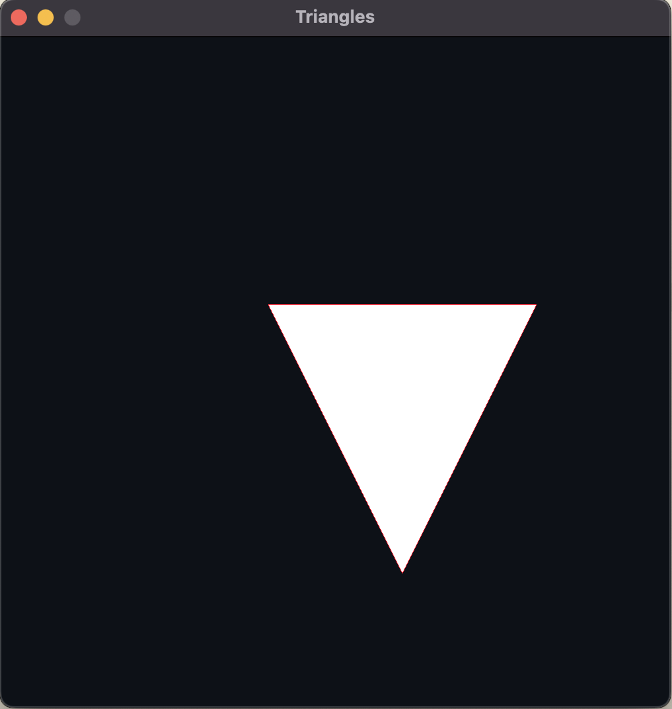

# RaylibCPP
Repositório para armazenar os programas que desenvolvo em c++ à medida que estudo sobre Raylib e jogos
## Outputs :
>  
> 

>
> hello_world
> 
> 

> 

>   
> 

>   
  
> 

>
>  
> 

>
> rectangles
> 
> 

> 

>   
> 

>   
  
> 

>
> triangles
> 
> 

> 

>   
> 

>   
  
> 

>