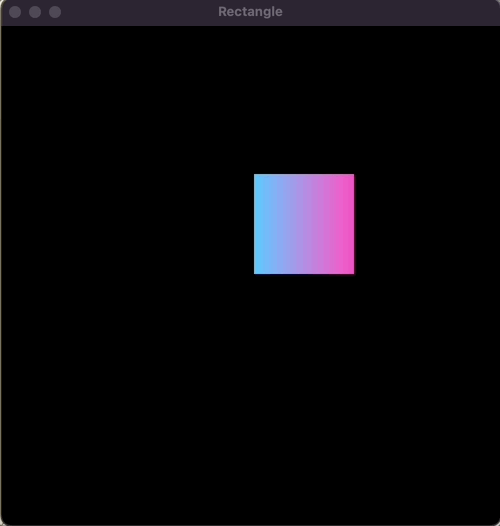

# RaylibCPP
Repositório para armazenar os programas que desenvolvo em c++ à medida que estudo sobre Raylib no curso:
<a href="https://www.udemy.com/share/107eOK3@A3TXQR1VRKS5SWMSblz4uO5f_aeycxKZ10SpWDcLrd_goeBkUgBrAmIXTtEa4HjwvQ==/">Udemy Course</a>
## Outputs :
>  
> 

>
> hello_world
> 
> 

> 

>   
> 

>   
  
> 

>
>  
> 

>
> rectangles
> 
> 

> 

>   
> 

>   
  
> 

>
> triangles
> 
> 

> 

>   
> 

>   
  
> 

>
> lines
> 
> 

> 

>   
> 

>   
  
> 

>
> polygones
> 
> 

> 

>   
> 

>   
  
> 

>
> pixels
> 
> 

> 

>   
> 

>   
  
> 

>